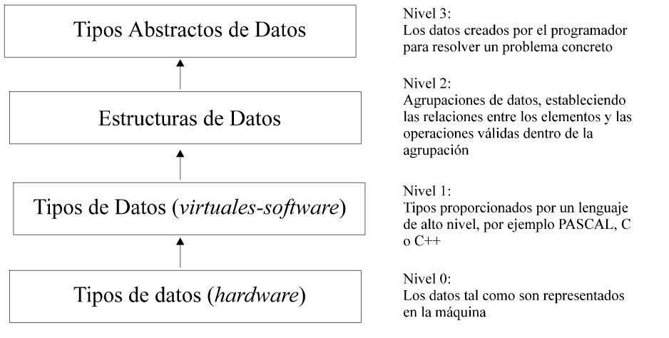

# Ideas

* Cita Libro: Estructuras de Datos en C++ trata sobre el estudio de las estructuras de datos dentro del marco de trabajo de los tipos abstractos de datos (TAD) y objetos, bajo la óptica del análisis, diseño de algoritmos y programación, realizando las implementaciones de los algoritmos en C++.

* Hay que empezar hablando de la abstracción: El exceso de detalles hace más difícil tratar con los problemas.Para concentrarnos en lo realmente importante,abstraemos el problema, eliminando todos los detalles innecesarios.
	* Tipos de abstracción: 
		* Funcional: abstrae una operación. Programación estructurada y modular. Uso de funciones. especificación e implementación. **Añadimos operaciones**.
		* De datos: Abstrae un tipo de dato. El uso que se puede hacer de este tipo. **Añadimos tipos de datos**. 

* ¿Cómo podemos modelar la abstracción de datos? Usando un modelo matemático: los TAD.
	* TAD: un modelo matemático para definir tipos de datos. Se define un tipo de datos que queremos que se comporte de una manera concreta. En ningún momento se dice la estructura de datos que se tiene que usar para la implementación. Tampoco se índica cómo debe ser los algoritmos que implementan las acciones que puede realizar el tipo. Dependiendo de la estructura de datos elegida para implementar los TAD los algoritmos pueden ser más o menos eficientes. 
		* Propiedad: Independencia. Cuando definimos una ADT,hay independencia de su implementación, tu podrías implementar esa Pila, con arrays, con listas ligadas,... dependiendo de cómo lo hagas tendrá un coste u otro coste.

* No es lo mismo tipo de datos, estructura de datos y TAD: http://informatica.uv.es/iiguia/AED/oldwww/2001_02/Teoria/Tema_10.pdf

	* Los datos son las propiedades o atributos (cualidades o cantidades) sobre hechos u objetos que procesa el ordenador. Un dato El tipo de datos, en un lenguaje de programación, define el conjunto de valores que una determinada variable puede tomar, así como las operaciones básicas sobre dicho conjunto. Definen cómo se representa la información y cómo se interpreta. Los tipos de datos constituyen un primer nivel de abstracción, ya que no se tiene en cuenta cómo se representa realmente la información sobre la memoria de la máquina, ni cómo se manipula. 

		Dos tipos: predefinidos en el lenguaje y definidos por el usuario.
		Dos tipos: Simples y cpmplejos. 

		A los tipos de datos le falta las operaciones.
	* Las estructuras de datos son agrupaciones de datos, quizás de distinta naturaleza(tipo), relacionados (conectados) entre sí de diversas formas y las operaciones definidas sobre esa agrupación. Las estructuras de datos se caracterizan por el tipo de los elementos de la estructura, las relaciones definidas sobre los elementos y las operaciones permitidas sobre la estructura. Operaciones típicas sobre estructuras de datos suelen ser: buscar y acceder a los elementos (por la posición que ocupan en la estructura o por la información que contienen), insertar o borrar elementos, modificar las relaciones entre los elementos, etc.
	* En el nivel más alto de abstracción estarían los tipos abstractos de datos, éstos se pueden ver como modelos matemáticos sobre los que se definen una serie de operaciones. En realidad son una formalización del concepto de dato que el programador considera adecuado para resolver el problema.El tipo abstracto de datos, al igual que las estructuras de datos, es independiente del lenguaje de programación, ya que un tipo abstracto de datos (en adelante TAD) es una colección de valores y de operaciones  que  se  definen  mediante  una  especificación  que  es  independiente  de  cualquier representación.

### Tipos Abstractos de Datos en C++: Clases

Una clase, en C++, es una estructura de datos que contiene, además de la información propia de un cierto elemento (igual que un registro), los procedimientos y funciones propias para manipular‘correctamente’ la información contenida en el registro.

Se definen dos apartados: apartado público, y apartado privado.
La declaración de una clase en un fichero .h (por ejemplo,fecha.h), y su implementación en un fichero .cpp asociado(por ejemplo, fecha.cpp).

